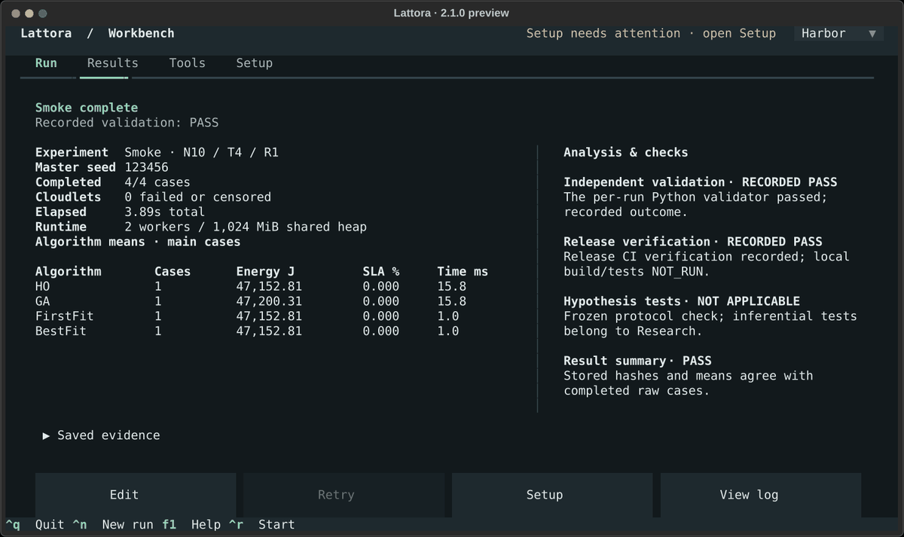
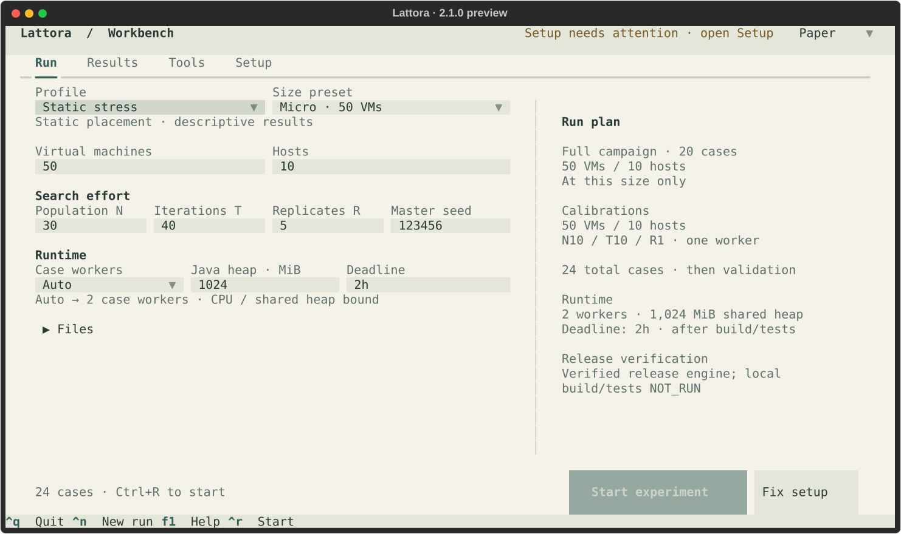
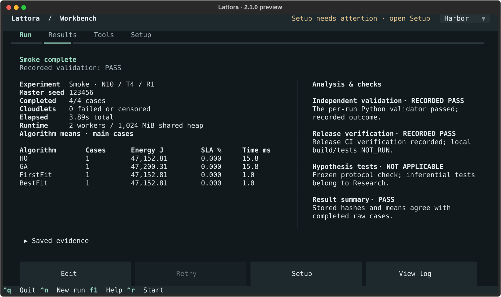

<p align="center">
  <picture>
    <source media="(prefers-color-scheme: dark)" srcset="logo/dark.svg">
    <source media="(prefers-color-scheme: light)" srcset="logo/light.svg">
    
  </picture>
</p>
<p align="center">
  <strong>Reproducible VM placement experiments, in your terminal.</strong>
</p>
<p align="center">
  2.1.0 preview · Linux x86-64 · Linux ARM64 · macOS Apple Silicon
</p>
<p align="center">
  <a href="#install">Install</a> ·
  <a href="#your-first-experiment">Quickstart</a> ·
  <a href="#commands">Commands</a> ·
  <a href="EXPERIMENTS.md">Experiment guide</a> ·
  <a href="CONTRIBUTING.md">Contribute</a>
</p>

Lattora compares Hippopotamus Optimization (HO), Genetic Algorithm (GA),
FirstFit and BestFit for static VM placement with **CloudSim Plus 8.5.7**.
Plan, run and inspect experiments in one terminal workbench.

- Choose frozen Research or configurable, descriptive Stress.
- Follow live progress; inspect units and recorded validation.
- Work offline with bundled runtimes, engine and independent validators.
- Update manually or roll back; keep your experiments and settings.

<p align="center">
  <a href="media/workbench.gif"></a>
</p>
<p align="center">
  <sub>Tour of the workbench: browse a retained Smoke run and switch themes. Stress screens show configuration only. <a href="media/README.md">Capture notes</a>.</sub>
</p>

## Install

**Linux and macOS use the same installer and the same `lattora` command.**
The standalone app needs no Python, Java, Git or Maven installation.

> [!NOTE]
> Version 2.1.0 has not been published yet. The command below becomes usable
> once the stable release is available.
> To build or try an unpublished archive, see the [distribution guide](DISTRIBUTION.md).

```sh
curl -fsSL https://github.com/puneet-chandna/Lattora/releases/latest/download/install.sh | bash
```

Open a new terminal, or run the activation command printed by the installer, then:

```sh
lattora
```

The installer verifies and health-checks the archive before activation. It adds
`~/.local/bin` to Bash, Zsh or Fish configuration once and preserves unrelated
commands. [Installer options](DISTRIBUTION.md#installer-options) cover pinned
versions and `--no-modify-path`.

Supported packages target glibc Linux x86-64, glibc Linux ARM64 and native
Apple Silicon macOS. Windows, Intel macOS, 32-bit ARM and Alpine/musl packages
are deferred. Runs require at least 3 GiB usable memory and enough headroom for
the selected heap; `lattora doctor` checks your environment.

## Your first experiment

In the TUI, choose **Smoke**, review the run plan, and start. Run, Results,
Tools and Setup stay accessible while work is in progress. `F1` opens help,
`F2` through `F5` switch tabs, `Ctrl+R` starts a run, `Ctrl+C` opens cancellation,
and `Ctrl+Q` quits. Harbor, Ember and Paper themes are available in Setup.

For a command-driven run on either Linux or macOS:

```sh
lattora run --profile smoke
# Independently recheck the campaign directory printed by the run:
lattora validate "/path/to/retained/campaign" --plain
```

Each run retains its inputs, logs, raw results and validation evidence. Open
**Results** to inspect them or repeat validation. Experiments work offline;
launching Lattora never checks for updates.

## Profiles

| Profile | Purpose | VMs per scenario | Cases |
| --- | --- | --- | --- |
| `smoke` | Check the complete experiment pipeline | 10 | 4 |
| `explore` | Inspect descriptive comparisons | 10, 50 | 40 |
| `research` | Run the frozen protocol and sensitivity analysis | 10, 50, 100 | 450 |
| `stress` | Measure a configurable static campaign | User selected | Depends on settings |

```sh
lattora run --profile explore
lattora run --profile research --workers 2 --heap-mib 1024
```

Research settings and its 100-VM ceiling are fixed. Stress is descriptive and
does not extend the frozen research claims. The [experiment guide](EXPERIMENTS.md)
explains budgets, configuration, bounded Stress examples and output files.
Use `lattora run --help` for all experiment options.

<p align="center">
  <a href="media/stress-paper.png"></a>
</p>
<p align="center"><sub>Stress in Paper: size, search effort and calibrations. Configuration preview; not executed.</sub></p>

## Commands

| Command | What it does |
| --- | --- |
| `lattora` | Open the terminal workbench |
| `lattora run --profile PROFILE` | Run Smoke, Explore, Research or Stress |
| `lattora validate DIRECTORY` | Independently validate retained results |
| `lattora doctor` | Check installation, runtimes, memory and data paths |
| `lattora --version` | Print the installed version |
| `lattora update --check` | Check for a newer stable release |
| `lattora update [VERSION]` | Install the latest stable or a specified version |
| `lattora rollback` | Restore the previously active version |
| `lattora completion bash` | Print completions (also `zsh` and `fish`) |
| `lattora uninstall` | Remove the app while retaining results and settings |

Failed updates keep the active installation usable. Existing sessions keep
their release; new commands use the activated version. Updates and rollback
preserve user data.

## Results and interpretation

<p align="center">
  <a href="media/smoke-results.png"></a>
</p>
<p align="center"><sub>Smoke results: observed means, units and recorded checks. A pipeline check, with no research claim.</sub></p>

Installed experiments default to a central results library:

| Platform | Results | Settings |
| --- | --- | --- |
| Linux | `~/.local/share/lattora/results/` | `~/.config/lattora/settings.json` |
| macOS | `~/Library/Application Support/lattora/results/` | `~/Library/Application Support/lattora/settings.json` |

Linux respects `XDG_DATA_HOME`, `XDG_CONFIG_HOME` and `XDG_CACHE_HOME`. Explicit
`--output-dir` and `--config` paths are relative to the directory where you invoke
the command. See [storage and recovery](DISTRIBUTION.md#installation-and-recovery)
for cache paths and installation layout.

Results are conditional on a synthetic, static simulator model. Lattora claims
no algorithm winner or real datacenter saving. Research reports `NO_CLAIM`
when the required statistical inference is degenerate. Only complete,
independently validated datasets are eligible evidence; pre-v2 results and
interrupted runs are not. Installed runs record release verification separately
and keep local tests marked `NOT_RUN`.

## Development and documentation

Contributors use `./cloudsim.sh` in a source checkout for setup, builds and tests.
The [development guide](DEVELOPMENT.md) covers Linux and Apple Silicon setup,
JDK selection and direct engine commands.

[Experiments](EXPERIMENTS.md) · [Contributing](CONTRIBUTING.md) ·
[Packaging and release](DISTRIBUTION.md) ·
[Project documentation](https://cloudsim-ho-project.puneetchandna.com/) ·
[Code of conduct](CODE_OF_CONDUCT.md)

Project source uses the [MIT license](LICENSE). Bundled dependencies retain
their own licenses, including CloudSim Plus GPL-3.0; see the
[dependency inventory](src/main/resources/META-INF/third-party/DEPENDENCIES.txt)
and [distribution guide](DISTRIBUTION.md#acceptance-and-release).
